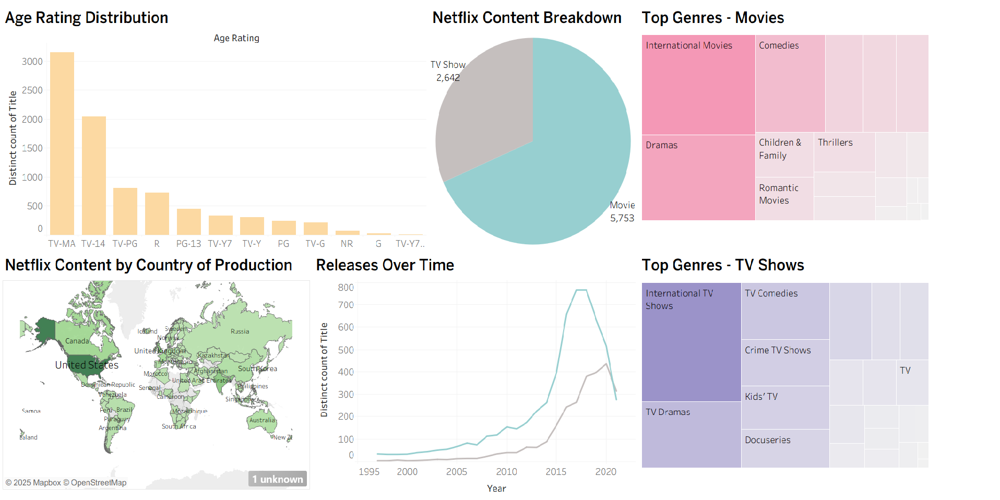

# Netflix Trends Dashboard (Tableau + Python)

This project combines **Python data preparation** and **Tableau visualization**  
to explore how **Netflix’s global content catalog** has evolved across genres, ratings, and countries.

It provides insights into Netflix’s production trends and international content distribution, all in an interactive dashboard.

---

## Project Overview

The dataset includes detailed information about **Netflix Movies and TV Shows**,  
covering **title, genre, release year, country, and age rating**.
fff
The dashboard allows users to:
- Identify the **most popular genres** for both Movies and TV Shows  
- Track **release trends over time**  
- Analyze **age rating distribution**  
- View **content availability by country** on an interactive world map  

---

## Technologies Used
- **Python** — Data cleaning and preprocessing  
- **Pandas** — Handling and transforming CSV files  
- **Tableau** — Building the interactive dashboard and visual analysis  

---

## How It Works

1. Download the raw dataset **netflix_titles.csv** from Kaggle  
2. Clean the data using the Python script **netflix_clean.py**
3. Import the cleaned dataset **netflix_clean.csv** into Tableau to create the visualizations and insights.  

---

## Dashboard Preview

